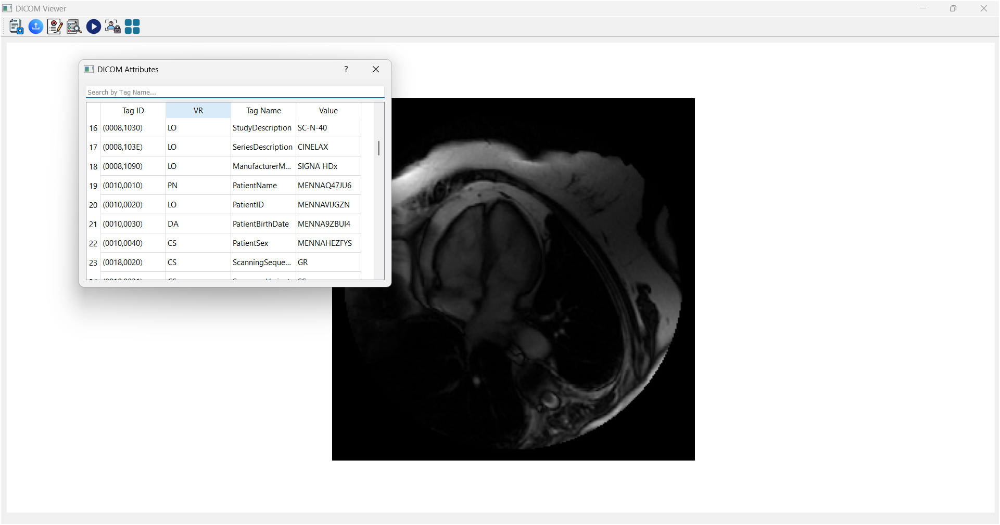
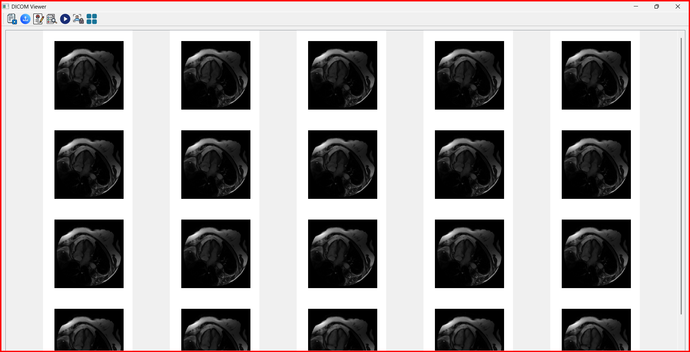

# DICOM Viewer
## Overview

DICOM Viewer is a desktop application built using Python and PyQt5 for viewing, analyzing, and anonymizing DICOM files. It supports various DICOM formats, offers different image display modes, enables metadata exploration, and includes an anonymization feature. The application is designed to provide an intuitive user interface for healthcare professionals, researchers, or anyone working with medical imaging data.
---
## Key Features

1. **Comprehensive File Support**  
   The application supports all types of DICOM files containing 2D, M2D (multiple 2D images), and 3D images, providing flexibility in the kinds of medical imaging it can handle.

2. **Versatile Image Display Modes**  
   - **2D Mode**: View single-frame 2D images with clarity.  
   - **M2D Mode**: For DICOM files containing multiple frames (M2D), the app can display them in a video-like format, showing dynamic sequences.  
   - **3D Mode**: Supports tile-based visualization, allowing you to navigate slices of a 3D volume, helping you understand complex imaging data.

3. **Metadata Navigation and Search**  
   - **DICOM Tags Exploration**: View a full list of DICOM tags and their corresponding values, essential for detailed examination of the file.  
   - **Search DICOM Tags**: Locate specific tags by searching for them, making it easier to find key details.  
   - **Quick Access to Core DICOM Groups**: The app provides buttons to quickly access critical sections, such as Patient, Study, Modality, Physician, and Image details.

4. **Data Anonymization**  
   The application features a built-in anonymization tool that replaces sensitive patient information with random values, allowing for secure sharing and processing without compromising privacy.

5. **User-Friendly Interface**  
   - **Toolbar**: Contains easy-to-use buttons for opening files, exploring tags, playing videos, toggling between tile modes, and anonymizing data.  
   - **Tile & Scroll Navigation**: Seamlessly navigate through multiple slices or images in grid or scroll views, offering a convenient way to view large datasets or 3D volumes.

---
## Requirements
- **Python 3.6 or later**
- **Libraries:**
  - PyQt5
  - pydicom
  - matplotlib
  - numpy

### Setup
Install dependencies using pip:
```bash
pip install PyQt5 pydicom matplotlib numpy
```

## Launch the Application
Run the following command in the terminal:
```bash
python dicom_viewer.py
```
---
## How to Use

### Opening Files
#### Open a Single DICOM File:
1. Click the **"Open DICOM"** button in the toolbar.
2. Select a DICOM file (.dcm) from your system.

#### Open a DICOM Folder:
1. Click the **"Open DICOM Folder"** button in the toolbar.
2. Select a folder containing DICOM files.

### Viewing Modes
#### Single Slice View:
- Displays one slice at a time for 2D images.

#### Video Mode:
- If the file contains multiple frames (M2D), click **"Play Video"** to toggle video playback.

#### Tile View:
- For 3D or multi-slice datasets, click **"Show Tiles"** to view all slices as tiles.

### Metadata Exploration
- Click **"Show Attributes"** to view all DICOM tags.
- Click **"Show Details"** to explore main DICOM elements (e.g., Patient, Study, etc.).
- Use the **search bar** in the attributes window to find specific tags.

### Anonymization
1. Open a DICOM file or folder.
2. Click the **"Anonymize DICOM"** button.
3. Enter a prefix when prompted. This prefix will be used to generate anonymized values for sensitive tags.
4. The anonymized file will be saved, overwriting the original.

### Toggle Views
- Use the **"Show Tiles"** button to switch between tile and single-slice views

---
# Screenshots

## DICOM_Attributes 

  

## Toggle_Tiles

  


---
# videos

[](https://drive.google.com/file/d/1Y8FHHkb16tyYth9BoHiIQ6izWYsNtv42/view?usp=drive_link)

## Folder Structure
```plaintext
📂 DICOM_Viewer
├── 📂 src
│   ├── dicom_viewer.py       # Entry point of the application
├── 📂 Icons          # Icons, styles, and other assets
├── 📂 data    # The data shown in screenshots
└── README.md         # This file
```


## Acknowledgments
Special thanks to **Dr. Tamer Basha**, whose guidance and expertise have been invaluable in the development of this project. We deeply appreciate your support and insightful feedback, which have significantly enhanced the application's design and functionality.

Additionally, thanks to the **open-source community** for providing tools and libraries that made this project possible.

