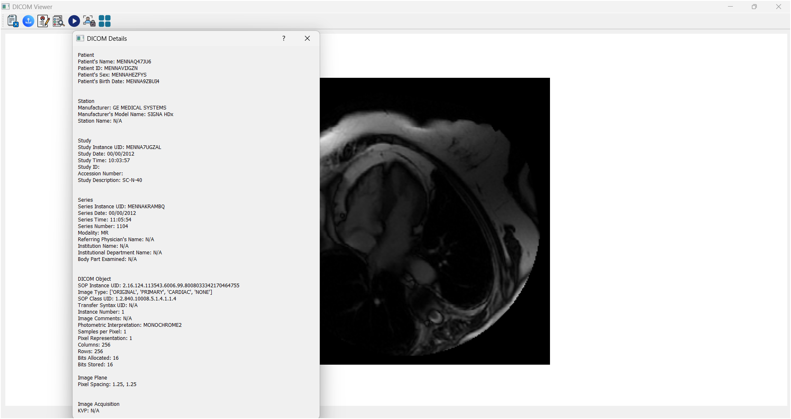
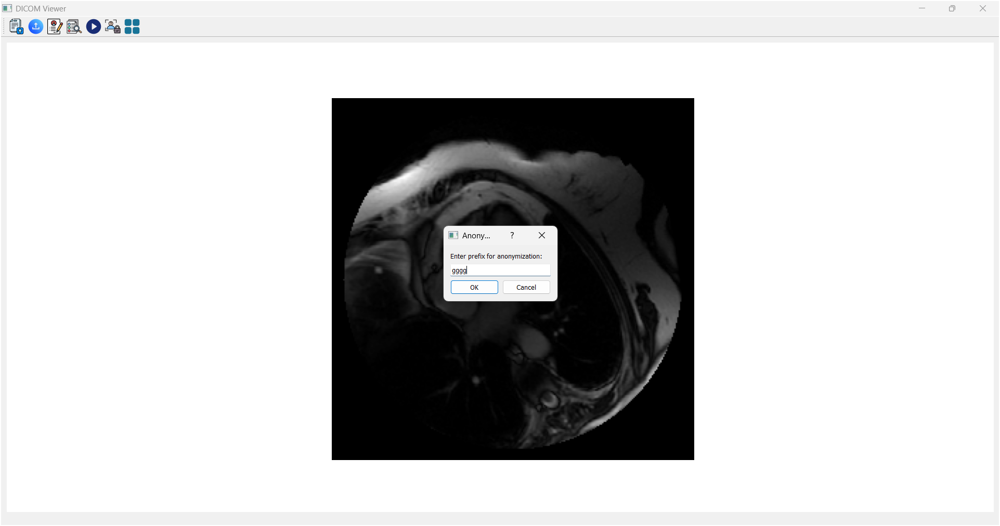

# DICOM Viewer
## Overview

DICOM Viewer is a desktop application built using Python and PyQt5 for viewing, analyzing, and anonymizing DICOM files. It supports various DICOM formats, offers different image display modes, enables metadata exploration, and includes an anonymization feature. The application is designed to provide an intuitive user interface for healthcare professionals, researchers, or anyone working with medical imaging data.

## Key Features

1. **Comprehensive File Support**  
   The application supports all types of DICOM files containing 2D, M2D (multiple 2D images), and 3D images, providing flexibility in the kinds of medical imaging it can handle.

2. **Versatile Image Display Modes**  
   - **2D Mode**: View single-frame 2D images with clarity.  
   - **M2D Mode**: For DICOM files containing multiple frames (M2D), the app can display them in a video-like format, showing dynamic sequences.  
   - **3D Mode**: Supports tile-based visualization, allowing you to navigate slices of a 3D volume, helping you understand complex imaging data.

3. **Metadata Navigation and Search**  
   - **DICOM Tags Exploration**: View a full list of DICOM tags and their corresponding values, essential for detailed examination of the file.  
   - **Search DICOM Tags**: Locate specific tags by searching for them, making it easier to find key details.  
   - **Quick Access to Core DICOM Groups**: The app provides buttons to quickly access critical sections, such as Patient, Study, Modality, Physician, and Image details.

4. **Data Anonymization**  
   The application features a built-in anonymization tool that replaces sensitive patient information with random values, allowing for secure sharing and processing without compromising privacy.

5. **User-Friendly Interface**  
   - **Toolbar**: Contains easy-to-use buttons for opening files, exploring tags, playing videos, toggling between tile modes, and anonymizing data.  
   - **Tile & Scroll Navigation**: Seamlessly navigate through multiple slices or images in grid or scroll views, offering a convenient way to view large datasets or 3D volumes.

---
# Screenshots

## DICOM_Attributes 

  

## Toggle_Tiles

  

## DICOM_Details

  

## Anonymization

  

---
# videos

  

[](https://drive.google.com/file/d/1Kx5ZlWVpDM42MHVJYcEtOCEH-I3wHCmY/view)

---
### Requirements

To run the DICOM Viewer, you need the following:

- **Python 3.6 or later**
- PyQt5
- pydicom
- matplotlib
- numpy

You can install the necessary dependencies using pip:

```bash
pip install pydicom PyQt5 matplotlib numpy
```
