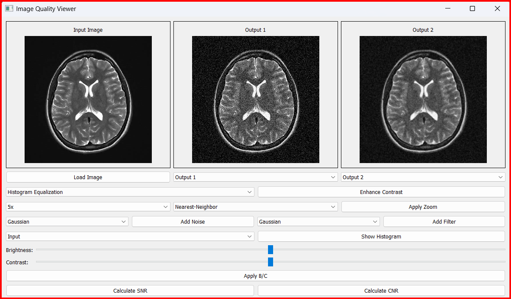
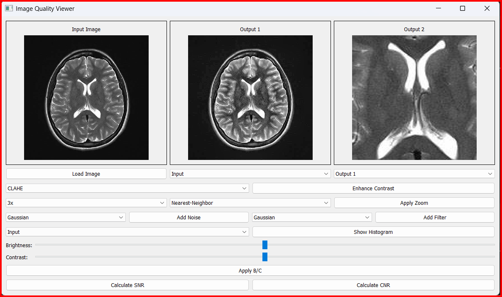
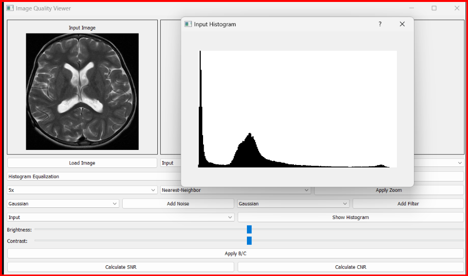
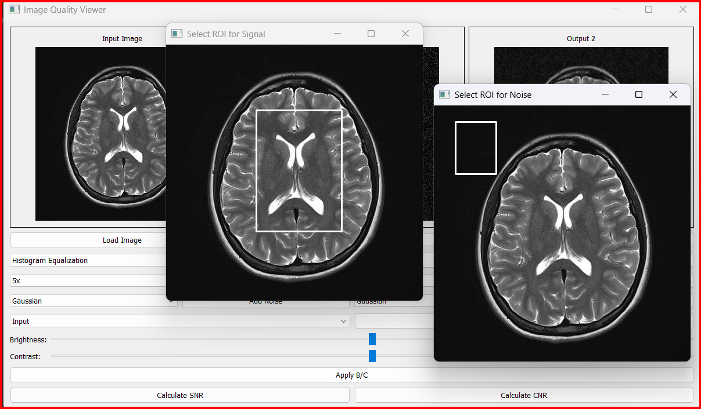
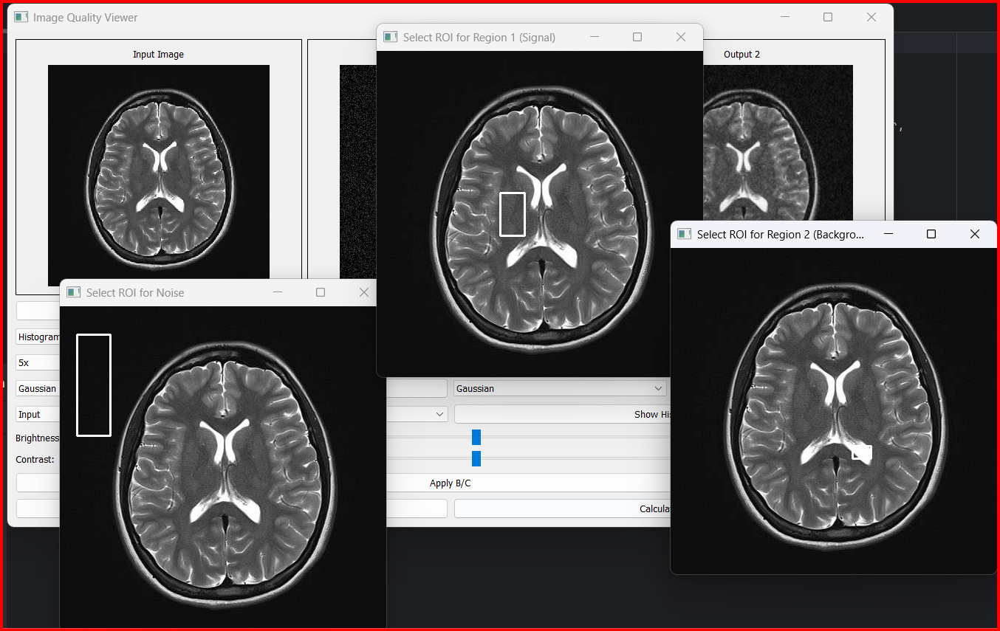

Image Quality Viewer 🩺🖼️
---
#### Overview

The **Image Quality Viewer** is a powerful desktop tool designed for analyzing and improving the quality of medical and scientific images. It provides a range of features that allow users to enhance images, analyze noise, and measure image quality. This tool is perfect for researchers, doctors, and anyone who works with images and needs to ensure their quality is as high as possible.

With an easy-to-use interface, users can load, process, and compare images side by side. The application includes advanced features like **contrast improvement**, **noise addition**, and **image filtering**, along with important quality measurements such as **Signal-to-Noise Ratio (SNR)** and **Contrast-to-Noise Ratio (CNR)**. These measurements help assess how clear and useful the images are, which is especially important in medical imaging for accurate diagnoses.

---

## Features

### Image Loading and Display
- **Support for common image formats**: PNG, JPG, BMP
- **Multiple view panels**:  
  - Input image  
  - Output 1 (processed image)
  - Output 2 (secondary processed image)
- **Synchronized display** of original and processed images

### Image Enhancement
- **Histogram Equalization**: Improve contrast by spreading out the most frequent intensity values.
- **CLAHE (Contrast Limited Adaptive Histogram Equalization)**: Adaptive method for enhancing local contrast.
- **Gamma Correction**: Adjust image brightness for better visibility.
- **Brightness and Contrast Adjustment**: Manual adjustments to image brightness and contrast.

### Zoom and Interpolation
- **Multiple zoom levels**:  
  - 0.25x to 5x zoom
- **Various interpolation methods**:  
  - Nearest-Neighbor  
  - Linear  
  - Bilinear  
  - Cubic

### Noise Generation
- **Gaussian Noise**: Add random noise from a Gaussian distribution.
- **Salt and Pepper Noise**: Add random white and black pixels to the image.
- **Speckle Noise**: Introduce noise with varying intensity across pixels.

### Filtering Options
- **Gaussian Filter**: Smoothing filter for noise reduction.
- **Bilateral Filter**: Edge-preserving smoothing filter.
- **Non-Local Means Denoising**: Denoising method that uses a patch-based approach.
- **Low-Pass Filter**: Remove high-frequency noise.
- **High-Pass Filter**: Highlight edges and fine details.

### Analysis Tools
- **Real-time Histogram Visualization**: Dynamic histogram of the image to analyze pixel distribution.
- **SNR (Signal-to-Noise Ratio) Calculation**: Measure the ratio of useful signal to noise.
- **CNR (Contrast-to-Noise Ratio) Calculation**: Evaluate the contrast to noise ratio for image quality assessment.

## Required Libraries

To run the application, install the following libraries:

```bash
pip install PyQt5
pip install opencv-python
pip install numpy
pip install matplotlib
 ```
## Usage

### 1.Run the Application:
To run the application, use the following command:

```bash
python ImageQ.py
```

### 2.Basic Operations:
- **Click "Load Image"** to open an image file from your system.
- **Select the source image** (Input/Output1/Output2) from the dropdown menu.
- **Choose the target output window** (Output1/Output2) where the processed image will be displayed.
- **Apply desired operations** using the control panel to modify the image.

### 3.Enhancement Operations:
- **Select enhancement type** (Histogram Equalization/CLAHE/Gamma Correction) from the available options.
- **Click "Enhance Contrast"** to apply the selected enhancement.
- **Adjust brightness/contrast** using the sliders to modify the image's brightness and contrast.
- **Click "Apply B/C"** to apply the changes made to brightness and contrast.

### 4.Noise and Filtering:
- **Select noise type** (Gaussian/Salt and Pepper/Speckle) to add noise to the image.
- **Click "Add Noise"** to apply the selected noise type.
- **Select filter type** (Gaussian/Bilateral/Non-Local Means/Low-Pass/High-Pass) from the filter options.
- **Click "Add Filter"** to apply the selected filter to the image.


### 5.Analysis:
- **Click "Show Histogram"** to view the intensity distribution of the current image.
- **Use "Calculate SNR"** to measure the Signal-to-Noise Ratio (SNR) of the image.
- **Use "Calculate CNR"** to measure the Contrast-to-Noise Ratio (CNR) of the image.


      <!-- Add the image here -->
      <!-- Add the image here -->
      <!-- Add the image here -->
  
---
 ### Quality Metrics

#### 1. SNR Calculation:
1. **Select ROIs** (Regions of Interest) for the signal and noise regions.
2. The application calculates the **Signal-to-Noise Ratio (SNR)** using the formula:
   - `SNR = mean(signal) / std(noise)`
3. This calculation provides a measure of the signal strength relative to the background noise.

  <!-- Add the image here -->

#### 2. CNR Calculation:
1. **Select ROIs** for two regions and one noise region.
2. The **Contrast-to-Noise Ratio (CNR)** is calculated using the formula:
   - `CNR = |mean(region1) - mean(region2)| / std(noise)`
3. CNR helps assess the difference in contrast between two regions relative to the noise in the image.

  <!-- Add the image here -->

---
### Interface Components

#### 1. **Main Display Area**:
- The application features **three image panels**:
  - **Input**: Displays the original image that will be modified.
  - **Output1**: Displays the image after applying the operations (e.g., contrast enhancement).
  - **Output2**: Displays another version of the image after applying different modifications or effects.

  You can choose which of these panels will display the original or modified image.

#### 2. **Control Panel**:
- The application has a control panel with several tools that allow you to apply various operations to the image:
  - **Dropdowns**: To select the type of operation you want to apply (e.g., contrast enhancement or noise addition).
  - **Brightness and Contrast Adjustment Sliders**: Controls for adjusting the brightness and contrast of the image.
  - **Zoom Control**: Lets you zoom in or out on the image, with options to select the interpolation method (e.g., **Nearest-Neighbor**, **Linear**, **Bilinear**, **Cubic**).

#### 3. **Noise and Filter Type Selection**:
- This section lets you select the type of noise to add to the image:
  - **Noise Types**: Gaussian, Salt and Pepper, Speckle.
- You can also select the filter to apply to the image after adding noise:
  - **Filters**: Gaussian, Bilateral, Non-Local Means, Low-Pass, High-Pass.

#### 4. **Analysis Tools**:
- The application includes analysis tools for quality metrics:
  - **SNR Calculation**: Calculates the **Signal-to-Noise Ratio** (SNR) of the image.
  - **CNR Calculation**: Calculates the **Contrast-to-Noise Ratio** (CNR) of the image.
  - **Show Histogram**: Displays the **histogram** showing the intensity distribution of the image.
